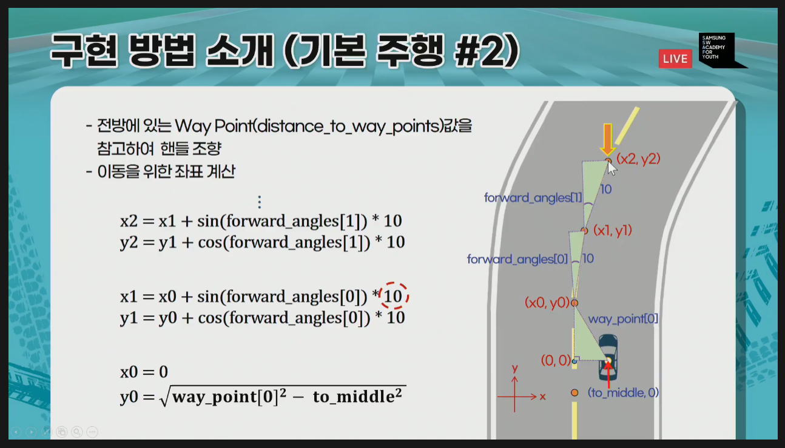
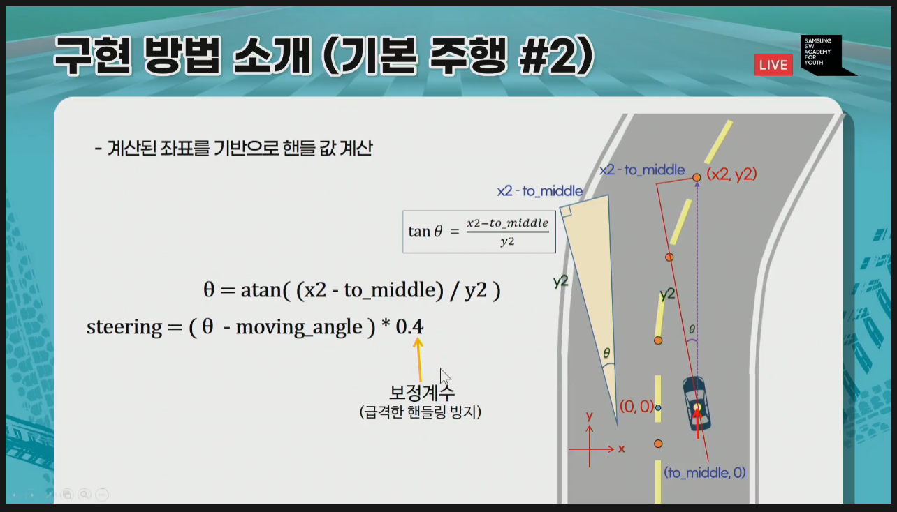
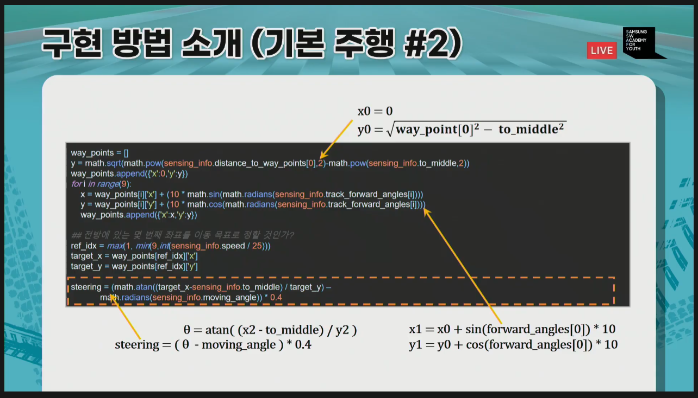
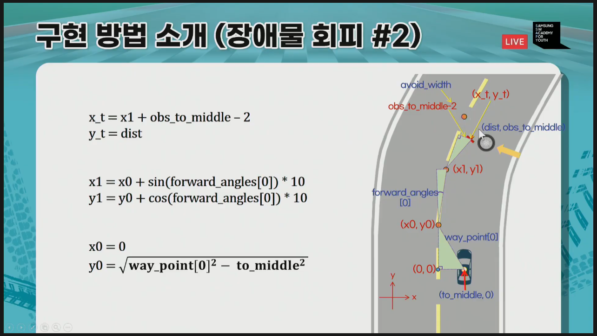
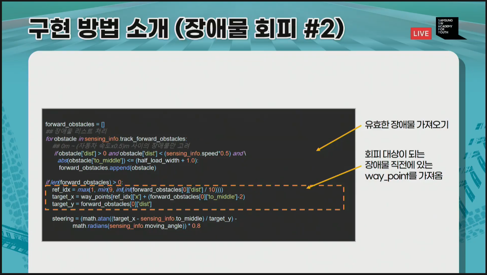
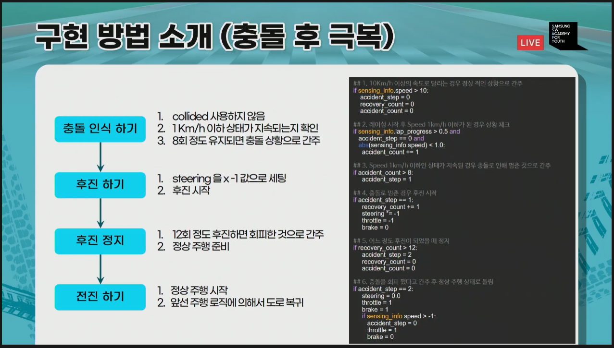
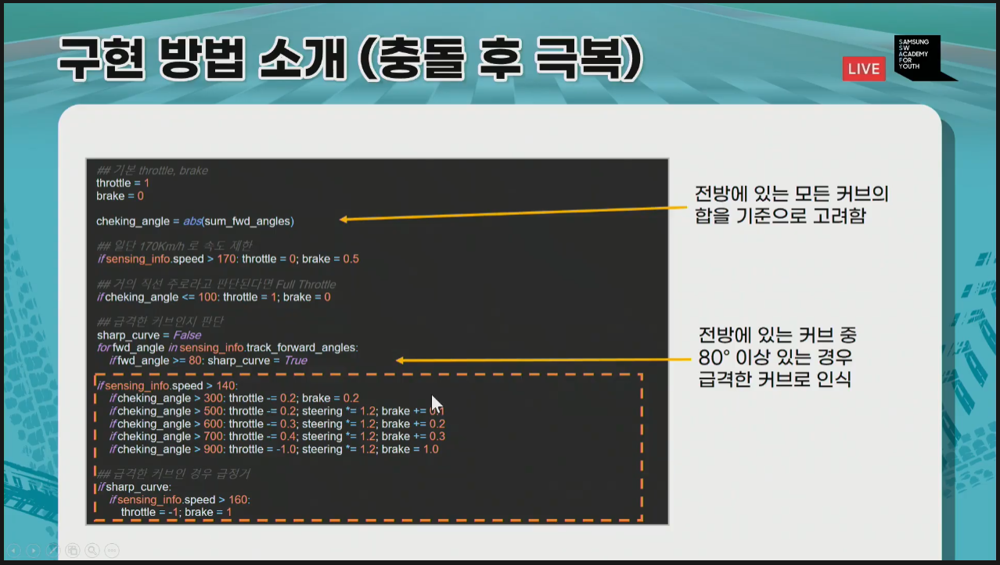
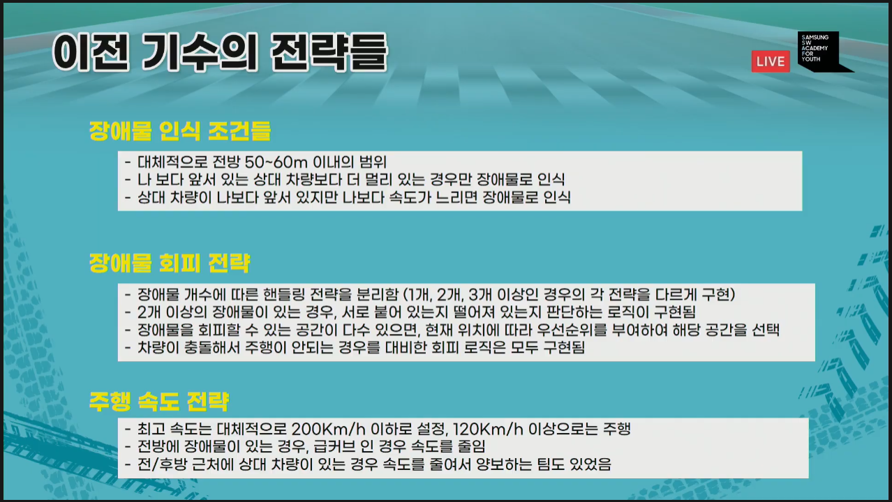
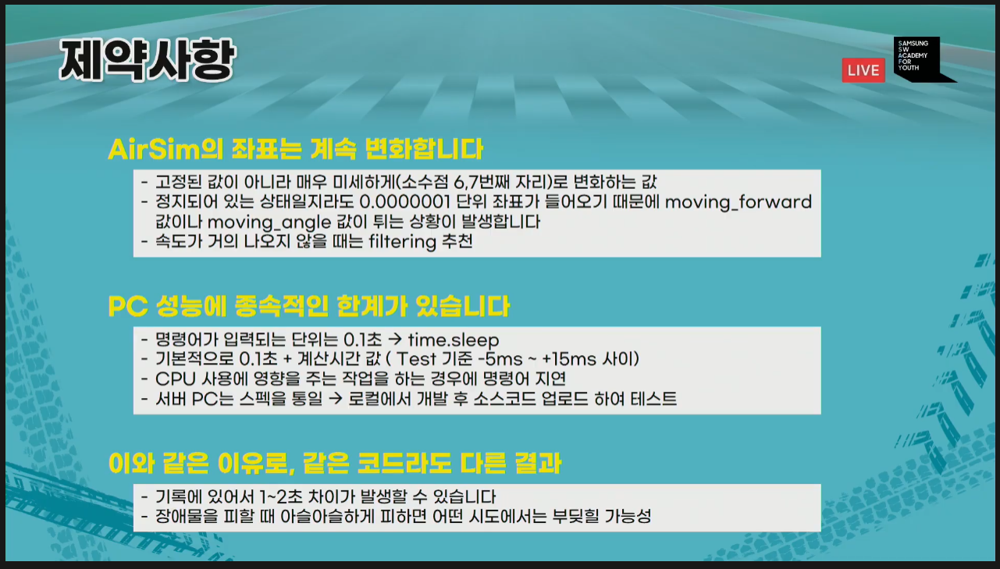

## 구현의 핵심

- 핸들조정(80), 속도 조정(20)
- 전방의 커브만 고려해 일정 비율로 핸들 계싼
- 전방 커브 & Way Point를 고려해 핸들 값 계산
- 전방 커브 & Way Point & 장애물 1개를 고려해 핸들 값 계산
- 전방 커브 & Way Point & 장애물 여러개를 고려해 핸들 값 계산
- 전방의 커브 각도, 장애물 개수에 따른 속도 조절 구현 추가

## 구현 방법 소개

### 기본 주행 1

- 속도가 빠를 수록 커브를 미리 돌려야 함

### 장애물 회피 1

### 기본 주행 2

